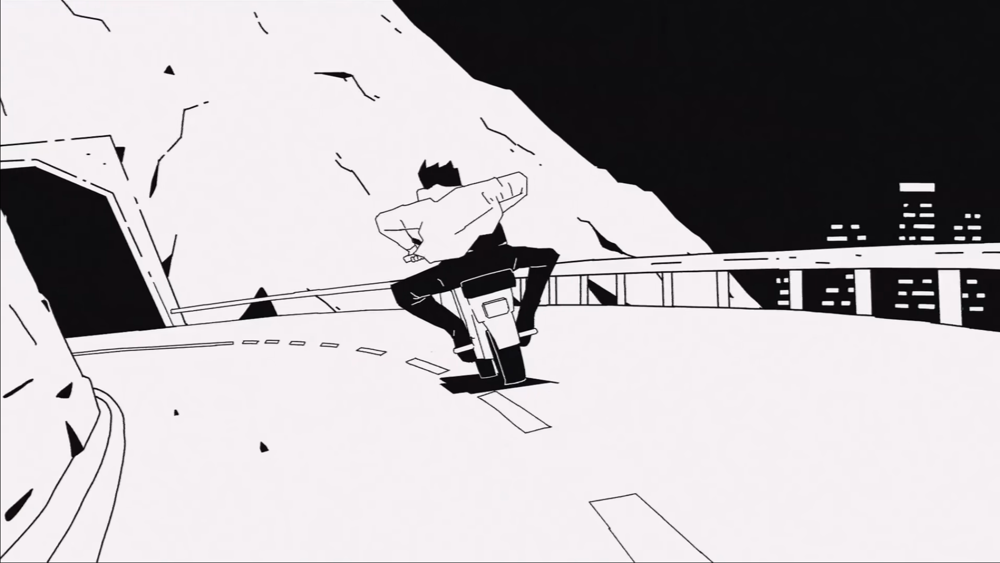
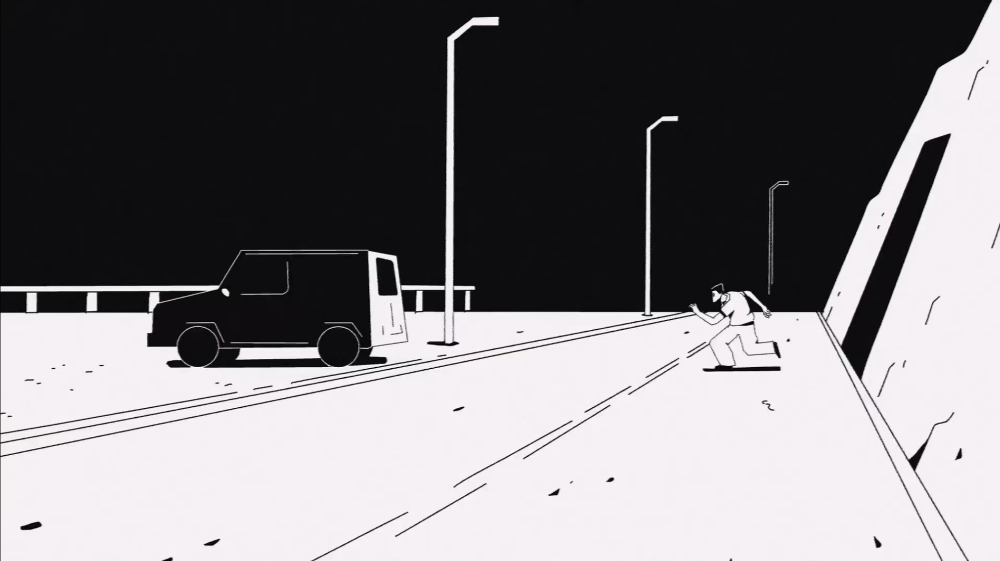
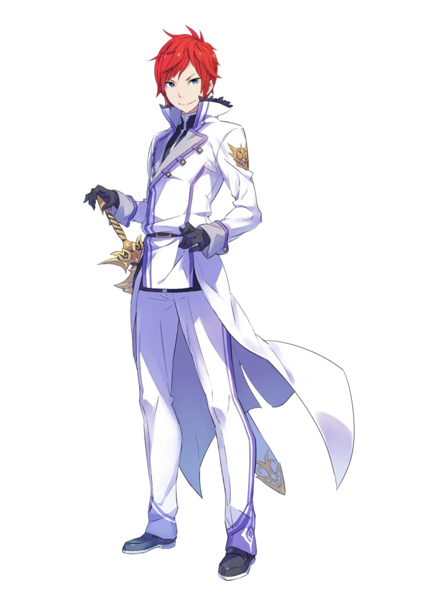
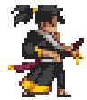
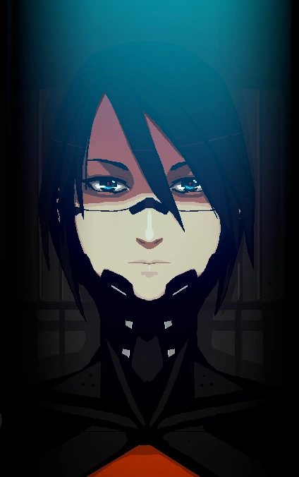
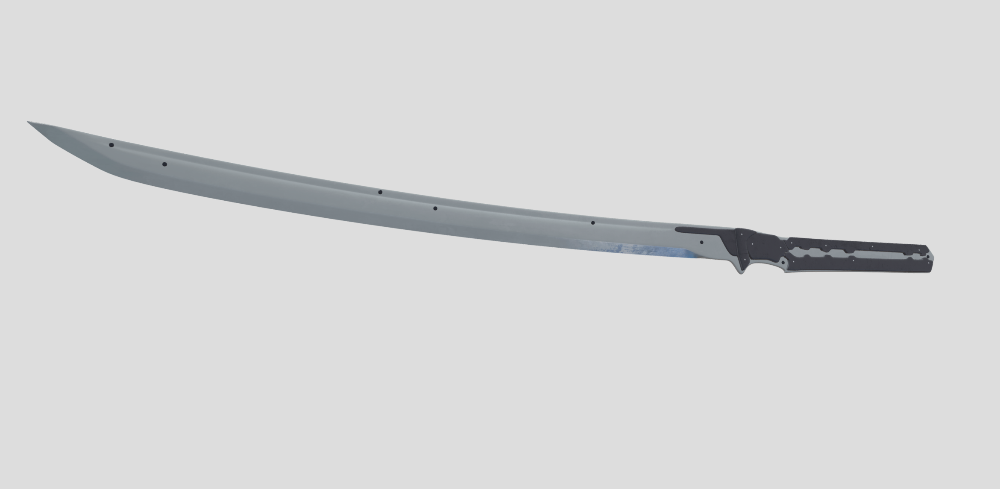

# Жанр

Жанры игры: action, platformer, pixel-art, slasher?

Референсы: [Katana ZERO](https://store.steampowered.com/app/460950/Katana_ZERO/), [ULTRAKILL?](https://store.steampowered.com/app/1229490/ULTRAKILL/), [Hollow Knight?](https://store.steampowered.com/app/367520/Hollow_Knight/), [Dead Cells?](https://store.steampowered.com/app/588650/Dead_Cells/)

> Знак `?` означает неуверенность в выборе жанра или референса.

# Синопсис

Пока отсутствует.

# Стиль игры

Игра должна подталкивать игрока к агрессивному поведению, но при этом и не должна являться слешером напролом. Главное, чем должен будет овладеть игрок – манёвренностью и всеми связанными с ней механиками, поскольку именно она поможет избегать атак для нанесения последующего удара.

# Управление

## Клавиатура + мышь

Движение влево (move_left): 

Движение право (move_right): 

Прыжок (jump): 

Атака (attack):  или 

## Геймпад

Движение влево (move_left): 

Движение право (move_right): 

Прыжок (jump): 

Атака (attack): 

# Системы и механики

## Кор-механики (системы)

### Передвижение

Передвижение игрока осуществляется влево/вправо. Во время движения на игрока действует ускорение `acceleration` в сторону его движения, причём скорость игрока во время движения не может превысить максимальную скорость `max_movement_speed`.

### Гравитация и падение

Если игрок не стоит на полу и при этом другими механиками не задано иное, то игрок начинает падать с постоянным ускорением `gravity`, при этом максимальная скорость падения игрока не может превысить `max_fall_speed`.

### Прыжок

Прыжок является импульсом, то есть во время прыжка игрок получает начальную скорость `jump_speed` вертикально вверх, если другими механиками не сказано иное. Остальную работу проделывает механика [Гравитация и падение](#Гравитация-и-падение).

### Скольжение по стенам

Если игрок касается стены и при этом не стоит на полу, то он скользит по стене. Скольжение по стене, по сути, это [Гравитация и падение](#Гравитация-и-падение), но теперь задаётся ускорением `sliding_acceleration` и максимальной скоростью скольжения `max_sliding_speed`. При этом, если скорость скольжения каким-то образом превысила ограничение, то эта скорость не сбрасывается и остаётся как есть.

Также в момент начала скольжения вертикальная составляющая скорости игрока не сбрасывается, то есть, если игрок прыгнул и начал скользить по стене, то он начнёт скользить вверх, и только спустя некоторое время вниз.

### Прыжок от стен

Похож на обычный [Прыжок](#Прыжок), но вектор начальной скорости прыжка `jump_speed` направлен под углом `jump_angle` от вертикали. Этот прыжок работает во время [Скольжения по стенам](#Скольжение-по-стенам).

### Атака ближнего боя

Атака ближнего боя, совершается в сторону, куда смотрит персонаж. Атака ближнего боя совершается за `duration` секунд и наносит целое число `damage` урона (обычно 1-2 единицы), если хитбокс атаки задел хёртбоксы. Атака ближнего боя имеет перерыв в `cooldown` секунд, возможно, равный 0 секунд. В случае с игроком атака совершается действием [Атаки (attack)](#Геймпад). Все атаки прерывают текущее состояние персонажа (если возможно), но по отношению к движению делятся на 2 вида:

#### Атака с движением

Атака игрока. Данный вид атаки помимо основных параметров имеет импульс `impulse`. То есть, при совершении этой атаки игрок двигается благодаря получению импульса, более того, этот импульс суммируется с текущим движением персонажа. Импульс совершается либо в направлении мышки, либо в направлении левого стика (для геймпадов).

#### Атака на месте

Довольно часто будет у врагов (разве что у слабых). У этой атаки нет дополнительных параметров, просто при её совершении персонаж стоит на месте, если на него не действуют внешние силы. Другими словами, скорость ходьбы полностью сбросится и такая атака будет совершена на месте, но если персонаж в этот момент падает, то атака будет совершена в падении.

### Атака дальнего боя

Атака дальнего боя совершается в сторону, куда смотрит персонаж. Все атаки дальнего боя характеризуются уроном `damage` и перерывов между атаками `cooldown`. Причём урон обязательно целочисленный, как и в случае [Атаки ближнего боя](#Атака-ближнего-боя).

#### Стрельба

Стрельба задаётся дополнительными параметрами в виде угла разброса `spread_angle` в градусах, скоростью снаряда `speed` и временем `initial_cooldown`, необходимым на совершение первой атаки. Причём `initial_cooldown` может равняться нулю или значению `cooldown` атаки.

### Обнаружение игрока

Если условиями игры не задано иного, то по-умолчанию игровым врагам нужно обнаружить игрока перед нападением на него. Иными словами, игровой ИИ по-умолчанию не знает об игроке и пребывает в своём заданном на этот случай режиме. Если враг обнаружил игрока, то ему становится известно его местоположение и запускается поведение на этот случай, причём если игрок успел скрыться, то враг идёт к последнему известному местоположению, пока не обнаружит исчезновение игрока. Обнаружение игрока может происходить посредством следующих механик:

#### Обнаружение зрением

Каждый враг (если не задано иного) обладает своим полем зрения. Поле зрения имеет форму трапеции, где меньшее из её оснований расположено в центре врага параллельно оси Y. Соответственно, поле зрения задаётся высотой трапеции `vision_length`, размером малого основания `close_vision_height` и размером большого основания `far_vision_height`.

#### Обнаружение через сородичей

Если какой-то враг обнаружил игрока, то он испускает информацию о нём в радиусе `info_radius` через `info_delay` секунд после изначального обнаружения, то есть, если какой-то другой враг оказался в пределах этого радиуса, то он тоже узнаёт о местоположении игрока.

## Сайд-механики

### Враги

#### Пассивное состояние

Под пассивным состоянием подразумеваю спокойное или бездействующее состояние игрового врага. Иными словами, это некоторый набор действий, который игровой враг совершает при отсутствии информации о враге.

#### Активное состояние

Под активным состоянием подразумеваю бой с игроком. То есть, это состояние активируется при получении информации об игроке и состоит из набора действий для боя с игроком.

#### Обычный мечник

##### Пассивное состояние

Осуществляет перемещение со скоростью `walk_speed` между заданными точками на карте, при этом в каждой точке может простоять на месте указанное время, причём это время задаётся в параметрах точки маршрута. При отсутствии маршрута ожидает на месте.

##### Активное состояние

1. В пределах своей платформы бежит к игроку со скоростью `run_speed` пока не сократит дистанцию до `attack_distance`
2. Если расстояние до игрока не больше `attack_distance`, то совершает [Атаку на месте](#Атака-на-месте)

## Микро-механики

# Параметры

# Дизайн

## Общий стиль

Вся графика игры выполнена преимущественно в чёрно-белых цветах, с редким применением остальных цветов. Не уверен, насколько это можно назвать нуаром, но стиль примерно должен быть как на двух картинках снизу:

Скрины взяты из клипа [SIAMÉS "The Wolf"](https://youtu.be/lX44CAz-JhU), пока стиль игры представляю примерно таким, но всё это должно быть в pixel-art. Также предполагаю использование серых цветов, например, для теней, но только если это не испортит общий стиль. Остальные цвета будут применяться редко и, в основном, для привлечения внимания игрока.

## Дизайн персонажей

### Игрок

Игрок по **размерам** примерно такой же, как игрок в [Katana ZERO](https://store.steampowered.com/app/460950/Katana_ZERO/) (самая правая картинка), только ощущаться должен немного более узким. Игрок из [Katana ZERO](https://store.steampowered.com/app/460950/Katana_ZERO/) ощущается широковатым из-за одежды и руки на поясе, у нашего игрока такого не будет. В общем, игрок на вид должен быть человеком среднего размера и среднего телосложения, или даже в сторону небольшой худобы.

Остальной внешний вид напоминает некого рыцаря-мечника в лёгкой броне, пока самый близкий рефернс нашёл в виде Рейнхарда (самая левая картинка). Однако плащей, длинных волос и подобного стоит избегать, чтобы потом не пришлось это анимировать. У Рейнхарда одежда высокого класса, у игрока же она будет в похожем стиле, но менее роскошная. Возможно, стоит добавить небольшие элементы брони по типу наколенников и налокотников.

Помимо всего этого, у игрока должны быть какие-то механические детали: либо механическая рука, либо через одежду просвечиваются какие-то детали на теле, либо банально какая-то непонятная горизонтальная полоса на лице, как на нижней картинке ниже. Смысл в том, что игрок является скорее роботом, чем человеком, поэтому какие-то детали должны на это указывать. Но в то же время такие детали не должны быть чрезчур заметными, иными словами, игрок – робот, очень похожий на человека.

Шлема у игрока нет, так что его лицо и голова открыты. Конкретную причёску не выбрал, но, желательно, должна быть какой-то короткой, иначе длинные волосы придётся анимировать.

Из оружия у игрока одноручный меч или какой-то клинок. Оружие, как на картинке ниже вполне подойдёт. По поводу расположения меча точно не уверен: либо на поясе как у Рейнхарда, либо на спине как в [Hollow Knight](https://store.steampowered.com/app/367520/Hollow_Knight/).

## Lvl-дизайн

## Sound-дизайн

## VFX

# Прогрессия

# UI