# Жанр

Жанры игры: action, platformer, pixel-art, slasher?

Референсы: [Katana ZERO](https://store.steampowered.com/app/460950/Katana_ZERO/), [ULTRAKILL?](https://store.steampowered.com/app/1229490/ULTRAKILL/), [Hollow Knight?](https://store.steampowered.com/app/367520/Hollow_Knight/), [Dead Cells?](https://store.steampowered.com/app/588650/Dead_Cells/)

> Знак `?` означает неуверенность в выборе жанра или референса.

# Синопсис

Пока отсутствует.

# Стиль игры

Игра должна подталкивать игрока к агрессивному поведению, но при этом и не должна являться слешером напролом. Главное, чем должен будет овладеть игрок – манёвренностью и всеми связанными с ней механиками, поскольку именно она поможет избегать атак для нанесения последующего удара.

# Управление

Движение влево (move_left): 

Движение право (move_right): 

Прыжок (jump): 

Атака (attack): 

Бросок оружия (throw_weapon): 

Рывок (dash): 

# Системы и механики

## Кор-механики (системы)

### Механики движения

#### Ходьба и бег

Передвижение игрока осуществляется влево/вправо. Изменение скорости ходьбы / бега задаётся кривой `speed_curve` и временем её прохождения `acceleration_time`. Торможение происходит по той же самой кривой, но за время `deceleration_time`.

#### Прыжок

Прыжок задаётся кривой `jump_curve`, где по оси Y задаётся высота относительно начальной точки. Также указывается время прыжка `jump_time`, за которое осуществляется прыжок.

Если персонаж достиг земли до полного прохождения кривой (т.е. прыгнул на возвышенность), то прохождение кривой прыжка прерывается досрочно. Если же после прохождения кривой персонаж всё ещё не достиг земли, то падение продолжается с последней скоростью.

#### Гравитация и падение

Обычное падение связано с механикой [Прыжка](#Прыжок), поскольку происходит по тем же правилам, что и падение после достижения верхней точки прыжка.

#### Скольжение по стенам

Задаётся коэффициентом `friction` в диапазоне `[0, 1]`, если `friction = 0`, то какое-либо скольжение по стенам вовсе отсутствует, если `friction = 1`, то какое-либо движение вдоль стены сразу же аннулируется. При значении `friction = 0.5` в каждый момент времени составляющая скорости персонажа вдоль стены уменьшается вдвое.

> Не является критичным и пока можно опустить, лучше сделать упор на другие механики по типу механик боя.

#### Прыжок от стен

Похож на обычный [Прыжок](#Прыжок), но вектор скорости направлен под углом `jump_angle` от вертикали. Этот прыжок работает во время [Скольжения по стенам](#Скольжение-по-стенам).

> Не является критичным и пока можно опустить, лучше сделать упор на другие механики по типу механик боя.

### Механики боя

#### Frindly-Fire

Дружественный огонь **отсутсвует**, поэтому для любой механики боя должны быть настройки дружественных групп. Иными словами, персонажи могут принадлежать одной группе (понятие из движка), и они не могут применять механики боя против персонажей из той же группы.

#### Атака ближнего боя

Атака ближнего боя, совершается в сторону, куда смотрит персонаж. Атака ближнего боя совершается за `duration > 0` секунд и наносит целое число `damage` урона. Атака ближнего боя имеет перерыв в `cooldown >= 0`. В случае с игроком атака совершается действием [Атаки (attack)](#Геймпад). После запуска атаки запускается анимация, при этом атаку нельзя прервать или как-то повлиять на неё, если другой механикой не сказано иное.

#### Снаряды

Они же projectile'ы. Используются в механике [Стрельба](#Стрельба). Снаряды обладают своим спрайтом, содержат информацию об уроне `damage`, который наносят при попадании по персонажу, обладают скоростью `speed`, направлением движения `direction` и коэффициентом увеличения скорости в случае [парирования](#Парирование-снарядов) `parry_speed_multiplier`.

#### Парирование снарядов

Если при совершении [Атаки ближнего боя](#Атака-ближнего-боя) было попадание по [Снаряду](#Снаряды), то этот объект не наносит урона персонажу, который его отразил, и направление движения снаряда меняется на направление атаки.

#### Стрельба

Стрельба осуществляется в сторону, куда смотрит персонаж, создавая [Снаряды](#Снаряды) в направлении зрения персонажа. Стрельба обладает всеми данными, которые нужны для создания [Снаряда](#Снаряды), а так же обладает `cooldown` – время между выстрелами, `spread_angle` – угол разброса от желаемого направления в градусах.

### Обнаружение игрока

Если условиями игры не задано иного, то по-умолчанию игровым врагам нужно обнаружить игрока перед нападением на него. Иными словами, игровой ИИ по-умолчанию не знает об игроке и пребывает в своём заданном на этот случай режиме. Если враг обнаружил игрока, то ему становится известно его местоположение и запускается поведение на этот случай, причём если игрок успел скрыться, то врагу известно последнее местоположение игрока.

#### Обнаружение зрением

Каждый враг (если не задано иного) обладает своим полем зрения. Поле зрения имеет форму трапеции, где меньшее из её оснований расположено в центре врага параллельно оси Y. Соответственно, поле зрения задаётся высотой трапеции `vision_length`, размером малого основания `close_vision_height` и размером большого основания `far_vision_height`.

#### Обнаружение через сородичей

Если какой-то враг обнаружил игрока, то он испускает информацию о нём в радиусе `info_radius` через `info_delay` секунд после изначального обнаружения, то есть, если какой-то другой враг оказался в пределах этого радиуса, то он тоже узнаёт о местоположении игрока.

## Сайд-механики

### Враги

#### Пассивное состояние

Под пассивным состоянием подразумеваю спокойное или бездействующее состояние игрового врага. Иными словами, это некоторый набор действий, который игровой враг совершает при отсутствии информации о враге.

#### Активное состояние

Под активным состоянием подразумеваю бой с игроком. То есть, это состояние активируется при получении информации об игроке и состоит из набора действий для боя с игроком.

#### Обычный мечник

##### Пассивное состояние

Осуществляет перемещение со скоростью `walk_speed` между заданными точками на карте, при этом в каждой точке может простоять на месте указанное время, причём это время задаётся в параметрах точки маршрута. При отсутствии маршрута ожидает на месте.

##### Активное состояние

1. В пределах своей платформы бежит к игроку со скоростью `run_speed` пока не сократит дистанцию до `attack_distance`
2. Если расстояние до игрока не больше `attack_distance`, то совершает [Атаку на месте](#Атака-на-месте)

#### Стрелок

##### Пассивное состояние

Осуществляет перемещение со скоростью `walk_speed` между заданными точками на карте, при этом в каждой точке может простоять на месте указанное время, причём это время задаётся в параметрах точки маршрута. При отсутствии маршрута ожидает на месте.

##### Активное состояние

1. В пределах своей платформы бежит к игроку со скоростью `run_speed` пока не сократит дистанцию до `attack_distance`
2. Если расстояние до игрока не больше `attack_distance`, то совершает [Стрельбу](#Стрельба) на месте.

### Открытие уровней

Игра является абсолютно линейной, по этой причине каждый следующий уровень открыватеся только после прохождения предыдущего. При завершении текущего уровня игра не прерывается и переходит к новому уровню. Если же наблюдение осуществляется из какого-то меню уровней, то игроку будут доступны все пройденные уровни и один следующий, после последнего пройденного.

### Сохранение прогресса

По сути, всё сохранение прогресса заключается в сохранении количества пройденных уровней. Иными словами, любое открытие механик или предметов (если такое будет) фиксируется в самом уровне и всех следующих после него, поскольку игра абсолютно линейная и другой порядок прохождения уровней или открытия механик не предусматривается. По этой причине игре для восстановления прогресса необходимо знать только последний пройденный уровень.

## Микро-механики

# Дизайн

## Визуальный стиль

Вся графика игры должна быть преимущественно в чёрно-белых цветах и оттенках серого. Другие яркие цвета будут использоваться для привлечения внимания игрока, при этом использование тёмных или "грязных" цветов в обычных спрайтах не запрещается.

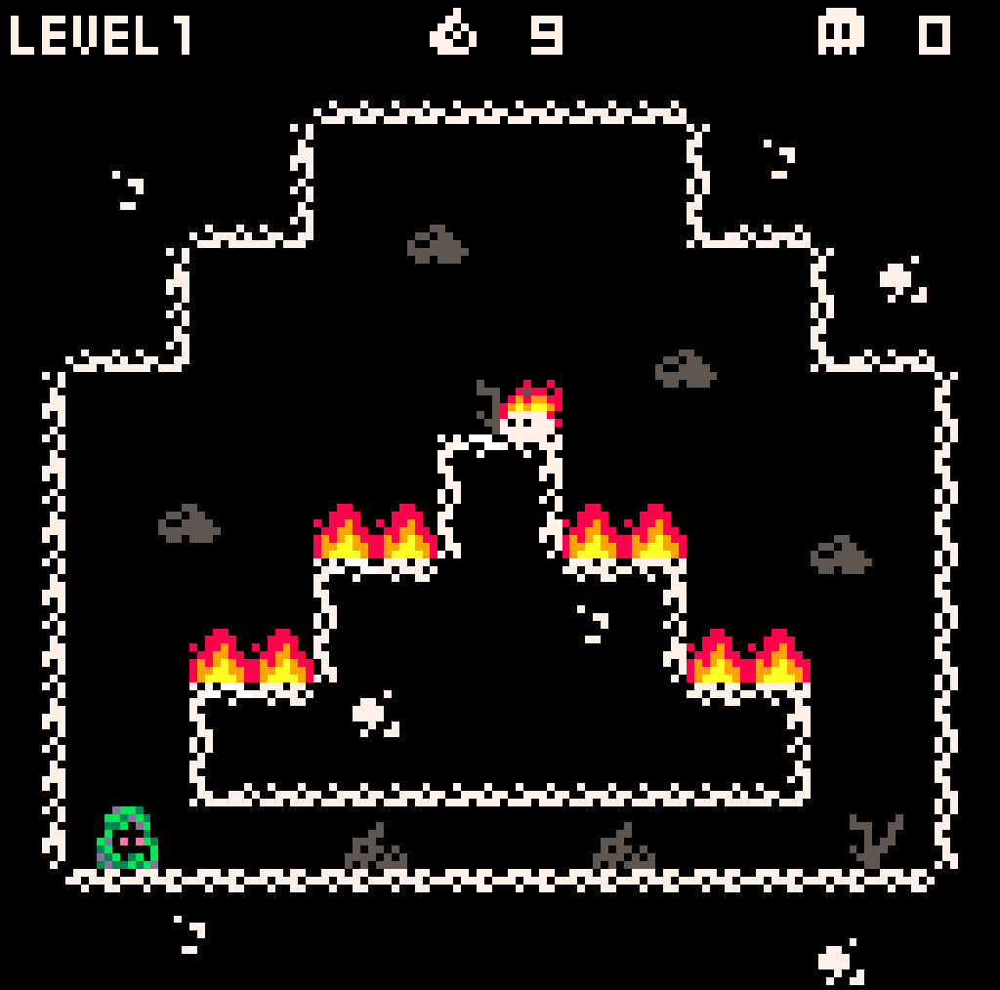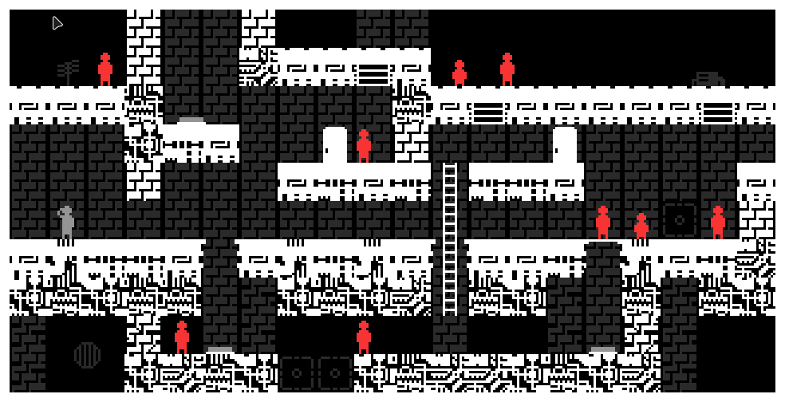

Хорошими референсами будут две вехрние картинки: как раз преимущественно чёрное-белые цвета, но есть немного сторонних дабы выделить важные объекты.

## Сеттинг

Чёткого сеттинга до сих пор нет и остаётся на усмотрение художника. Главное – чтобы спрайты соответствовали одному стилю.

## Дизайн персонажей

### Игрок

#### Внешний вид

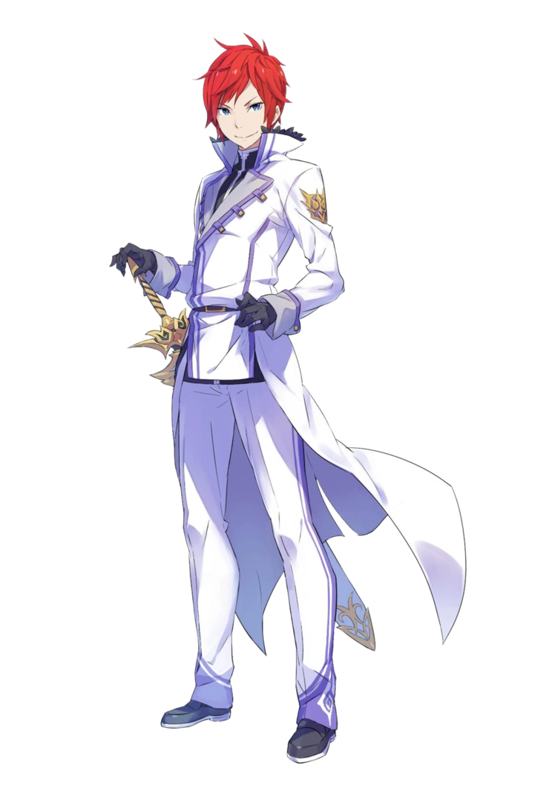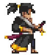

Игрок по **размерам** примерно такой же, как игрок в [Katana ZERO](https://store.steampowered.com/app/460950/Katana_ZERO/) (самая правая картинка), только ощущаться должен немного более узким. Игрок из [Katana ZERO](https://store.steampowered.com/app/460950/Katana_ZERO/) ощущается широковатым из-за одежды и руки на поясе, у нашего игрока такого не будет. В общем, игрок на вид должен быть человеком среднего размера и среднего телосложения, или даже в сторону небольшой худобы.

Остальной внешний вид напоминает некого рыцаря-мечника в лёгкой броне, пока самый близкий рефернс нашёл в виде Рейнхарда (самая левая картинка). Однако плащей, длинных волос и подобного стоит избегать, чтобы потом не пришлось это анимировать. У Рейнхарда одежда высокого класса, у игрока же она будет в похожем стиле, но менее роскошная. Возможно, стоит добавить небольшие элементы брони по типу наколенников и налокотников.

Помимо всего этого, у игрока должны быть какие-то механические детали: либо механическая рука, либо через одежду просвечиваются какие-то детали на теле, либо банально какая-то непонятная горизонтальная полоса на лице, как на нижней картинке ниже. Смысл в том, что игрок является скорее роботом, чем человеком, поэтому какие-то детали должны на это указывать. Но в то же время такие детали не должны быть чрезчур заметными, иными словами, игрок – робот, очень похожий на человека.

Шлема у игрока нет, так что его лицо и голова открыты. Конкретную причёску не выбрал, но, желательно, должна быть какой-то короткой, иначе длинные волосы придётся анимировать.

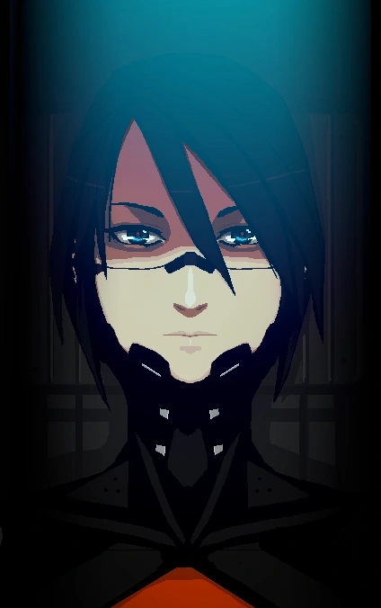

Из оружия у игрока одноручный меч или какой-то клинок. Оружие, как на картинке ниже вполне подойдёт. По поводу расположения меча точно не уверен: либо на поясе как у Рейнхарда, либо на спине как в [Hollow Knight](https://store.steampowered.com/app/367520/Hollow_Knight/).

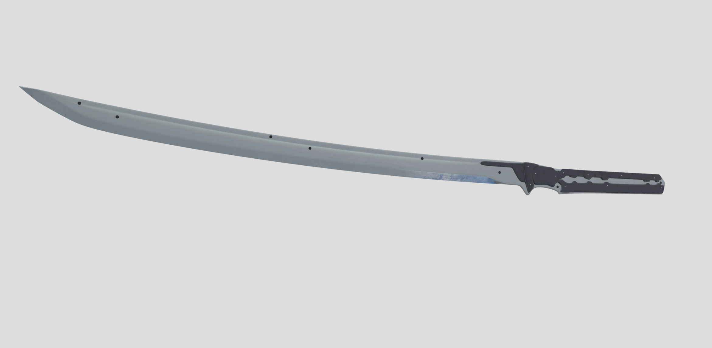

#### Анимация передвижения

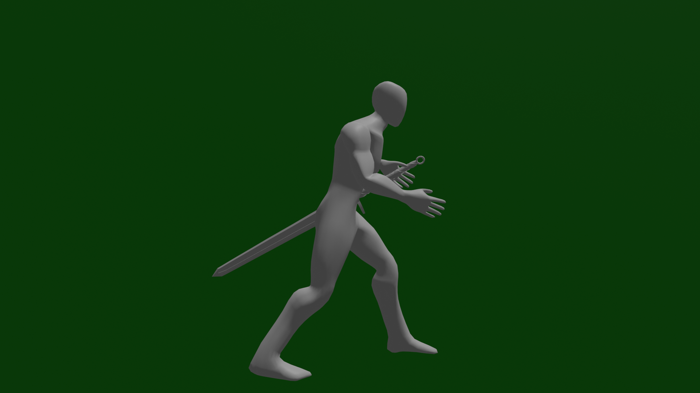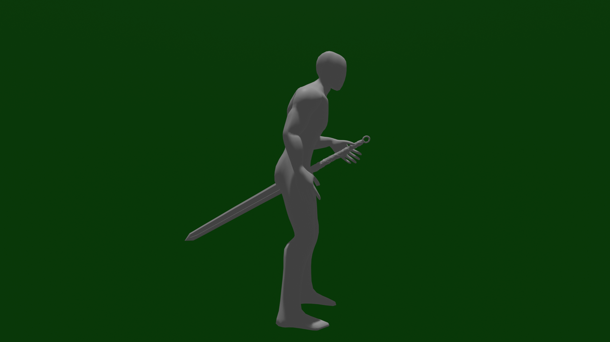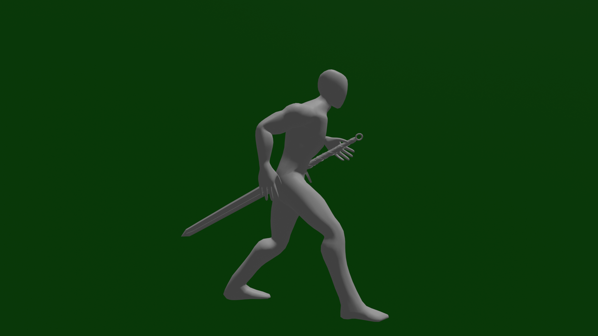

Ничего особого. Обычной ходьбы у игрока нет, он двигается довольно быстро, поэтому лучше подойдёт анимация бега. Из особенностей могу только отметить то, что левая рука остаётся на рукояти клинка, однако если в pixel-art это будет выглядеть плохо, то можно сделать самый обычный бег, где обе руки двигаются.

Так же в качестве референса можно использовать анимацию бега из [Katana ZERO](https://store.steampowered.com/app/460950/Katana_ZERO/), но не надо делать ноги полупрозрачными и не надо рисовать руки как у Наруто.

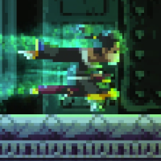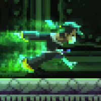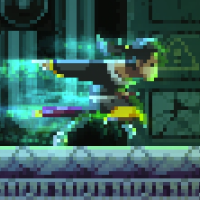

#### Анимация атаки

На примере атаки вправо: это просто быстрый горизонтальный взмах клинком перед игроком, осуществляется его роботизированной рукой.

Подобная анимация должна быть по 8 направлениям: вниз, влево-вниз, влево, влево-вверх, вверх, вправо-верх, вправо, право-вниз.

#### Анимация броска оружия

#### Анимация прыжка

На усмотрение художника, ничего особо в прыжке нет, игрок просто может прыгать выше своего роста.

#### Анимация падения

Под падением имеется ввиду не само приземление, а именно падение в воздухе. Ничего особого нет, на усмотрение художника.

#### Анимация рывка (dash)

#### Анимация скольжения по стенам

Тут даже скорее не анимация, а статичный спрайт. Когда игрок скользит по стене, то он держится за неё своей роботизированной рукой, а обычной придерживает клинок, при этом он пытается развернутся от стены. Попытался это изобразить ниже, но можно изменить на усмотрение художника:

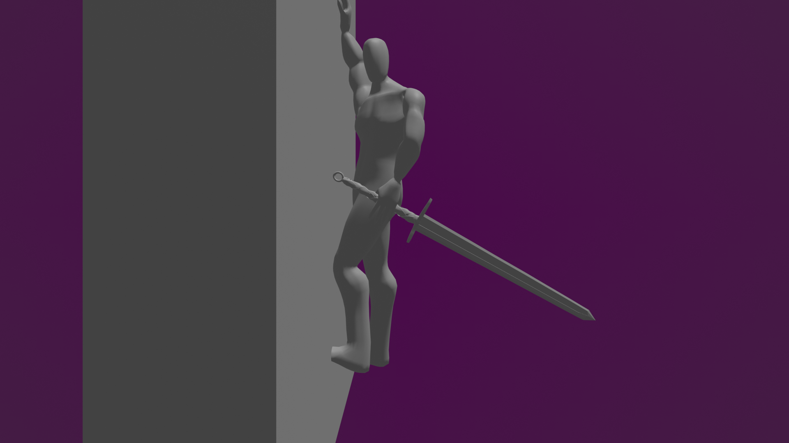

### Стрелок

#### Внешний вид

Должен соответствовать сеттингу и общему дизайну. Одет в лёгкую броню, на голове маска и шлем, так что ни лица, ни волос не видно. В руках автоматическая винтовка, но по внешнему виду похожа на винтовки времён 2-ой мировой войны, возможно, с некоторыми дополнениями, чтобы лучше вливалось в сеттинг.

## Lvl-дизайн

### TileSet (набор тайлов)

Все тайлы должны соответствовать [визуальному стилю](#Визуальный-стиль) и [сеттингу](#Сеттинг). Ниже будет приведён список необходимых тайлов.

#### Пол

Должен быть хотя бы в 1-ой вариации и, в основном, будет использоваться для нижней границы уровня.

#### Потолок

Должен быть хотя бы в 1-ой вариации и, в основном, будет использоваться для верхней границы уровня.

#### Стены

Должны быть хотя бы в 1-ой вариации и, в основном, будут использоваться для боковых границ уровня.

#### Платформы

Должны быть хотя бы в 1-ой вариации и, в основном, будут использоваться для построения содержимого уровня.

#### Механическая дверь

Эта дверь будет разграничителем уровней и будет автоматически открываться после прохождения текущего уровня. Помимо самого спрайта нужна анимация открытия этой двери. Картинку ниже можно использовать в качестве референса:

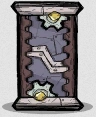

#### Фон

Тут на усмотрение художника. Либо надо сделать какой-то набор фоновых тайлов, либо сделать параллаксный фон: длинный арт с каким-нибудь городом (или что ещё может соответствовать сеттингу), который по мере продвижения 

### 1-ый уровень (обучение)

Уровень должен максимально понятно знакомить игрока с механиками игры и самыми базовыми врагами. Весь уровень должен состоять примерно из следующих частей:

- Подсказки для движения игрока влево/вправо и для прыжка
- Небольшой платформинг, нужно по платформам пропрыгать до возвышенности
- Подсказка для прыжка по стенам
- 2 соседние стены, от которых игроку нужно отпрыгивать, чтобы добраться выше
- Подсказка для рывка
- Необходимость перелететь через обрыв с ипользованием рывка
- Демонстрация обычного врага-мечника и необходимость одолеть его.
- Подсказка по парированию
- Враг-стрелок в прямом коридоре за ограждением, которого необходимо убить парированием его снаряда

## Sound-дизайн

## VFX

# Прогрессия

# UI