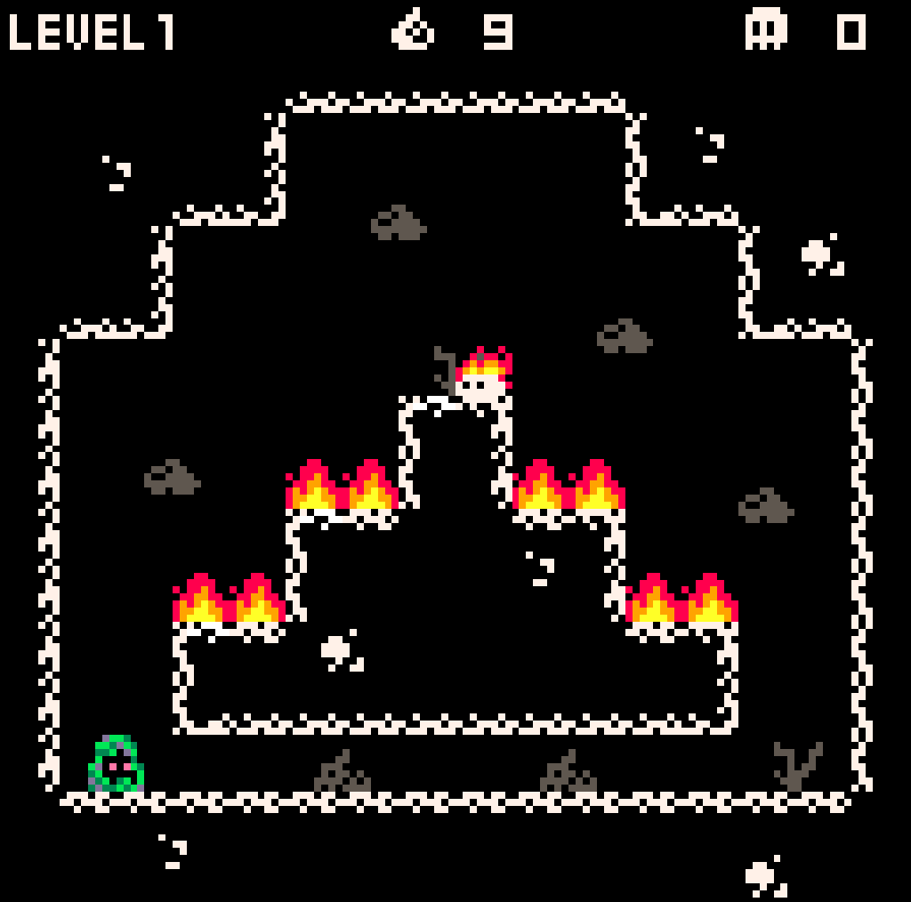

# Жанр

Жанры игры: action, platformer, pixel-art, slasher?

Референсы: [Katana ZERO](https://store.steampowered.com/app/460950/Katana_ZERO/), [ULTRAKILL?](https://store.steampowered.com/app/1229490/ULTRAKILL/), [Hollow Knight?](https://store.steampowered.com/app/367520/Hollow_Knight/), [Dead Cells?](https://store.steampowered.com/app/588650/Dead_Cells/)

> Знак `?` означает неуверенность в выборе жанра или референса.

# Синопсис

Пока отсутствует.

# Стиль игры

Игра должна подталкивать игрока к агрессивному поведению, но при этом и не должна являться слешером напролом. Главное, чем должен будет овладеть игрок – манёвренностью и всеми связанными с ней механиками, поскольку именно она поможет избегать атак для нанесения последующего удара.

# Управление

## Клавиатура + мышь

Движение влево (move_left): 

Движение право (move_right): 

Прыжок (jump): 

Атака (attack): 

Бросок оружия (throw_weapon): 

Рывок (dash): 

## Геймпад

Движение влево (move_left): 

Движение право (move_right): 

Прыжок (jump): 

Атака (attack): 

Бросок оружия (throw_weapon): 

Рывок (dash): 

# Системы и механики

## Кор-механики (системы)

### Передвижение

Передвижение игрока осуществляется влево/вправо. Во время движения на игрока действует ускорение `acceleration` в сторону его движения, причём скорость игрока во время движения не может превысить максимальную скорость `max_movement_speed`.

### Гравитация и падение

Если игрок не стоит на полу и при этом другими механиками не задано иное, то игрок начинает падать с постоянным ускорением `gravity`, при этом максимальная скорость падения игрока не может превысить `max_fall_speed`.

### Прыжок

Прыжок является импульсом, то есть во время прыжка игрок получает начальную скорость `jump_speed` вертикально вверх, если другими механиками не сказано иное. Остальную работу проделывает механика [Гравитация и падение](#Гравитация-и-падение).

### Скольжение по стенам

Если игрок касается стены и при этом не стоит на полу, то он скользит по стене. Скольжение по стене, по сути, это [Гравитация и падение](#Гравитация-и-падение), но теперь задаётся ускорением `sliding_acceleration` и максимальной скоростью скольжения `max_sliding_speed`. При этом, если скорость скольжения каким-то образом превысила ограничение, то эта скорость не сбрасывается и остаётся как есть.

Также в момент начала скольжения вертикальная составляющая скорости игрока не сбрасывается, то есть, если игрок прыгнул и начал скользить по стене, то он начнёт скользить вверх, и только спустя некоторое время вниз.

### Прыжок от стен

Похож на обычный [Прыжок](#Прыжок), но вектор начальной скорости прыжка `jump_speed` направлен под углом `jump_angle` от вертикали. Этот прыжок работает во время [Скольжения по стенам](#Скольжение-по-стенам).

### Атака ближнего боя

Атака ближнего боя, совершается в сторону, куда смотрит персонаж. Атака ближнего боя совершается за `duration` секунд и наносит целое число `damage` урона (обычно 1-2 единицы), если хитбокс атаки задел хёртбоксы. Атака ближнего боя имеет перерыв в `cooldown` секунд, возможно, равный 0 секунд. В случае с игроком атака совершается действием [Атаки (attack)](#Геймпад). Все атаки прерывают текущее состояние персонажа (если возможно), но по отношению к движению делятся на 2 вида:

#### Атака с движением

Атака игрока. Данный вид атаки помимо основных параметров имеет импульс `impulse`. То есть, при совершении этой атаки игрок двигается благодаря получению импульса, более того, этот импульс суммируется с текущим движением персонажа. Импульс совершается либо в направлении мышки, либо в направлении левого стика (для геймпадов).

#### Атака на месте

Довольно часто будет у врагов (разве что у слабых). У этой атаки нет дополнительных параметров, просто при её совершении персонаж стоит на месте, если на него не действуют внешние силы. Другими словами, скорость ходьбы полностью сбросится и такая атака будет совершена на месте, но если персонаж в этот момент падает, то атака будет совершена в падении.

### Парирование

Если при совершении [Атаки ближнего боя](#Атака-ближнего-боя) было попадание по снаряду или прочему projectile'у, то этот объект не наносит урона персонажу, который его отразил, и летит от него. При этом скорость снаряда увеличивается в `parry_speed_multiplier` раз, причём для каждого объекта значение этого параметра может отличаться. В случае игрока парированные снаряды отражаются в сторону мышки или левого стика.

### Бросок оружия

Пока планируется только для игрока. При совершении игрок бросает своё оружие в сторону мышки или левого стика (в случае геймпада), теряя после этого возможность [Атаки ближнего боя](#Атака-ближнего-боя). Само оружие летит строго по прямой со скоростью `speed` и наносит целочисленный урон в размере `damage` при попадании по врагу. Когда оружие попадает в какую-либо коллизию (стена, пол, враг и так далее) то оно остаётся в этой коллизии и торчит на половину из неё, причём оружие двигается за этой коллизией в случае её движения (враг). Если по какой-то причине изначальная коллизия пропала (смерть врага), то оружие под действием гравитации падает вниз, пока не столкнётся с другой коллизией.

#### Телепортация к оружию

После броска оружия игрок может к нему телепортироваться. То есть, игрок перемещается в текущую позицию оружия, возвращает себе это оружие и способность [Атаки ближнего боя](#Атака-ближнего-боя), и, соответственно, оружие больше никуда не летит.

> Пока звучит слишком имбово, надо будет пересмотреть.

### Атака дальнего боя

Атака дальнего боя совершается в сторону, куда смотрит персонаж. Все атаки дальнего боя характеризуются уроном `damage` и перерывов между атаками `cooldown`. Причём урон обязательно целочисленный, как и в случае [Атаки ближнего боя](#Атака-ближнего-боя).

#### Стрельба

Стрельба задаётся дополнительными параметрами в виде угла разброса `spread_angle` в градусах, скоростью снаряда `speed` и временем `initial_cooldown`, необходимым на совершение первой атаки. Причём `initial_cooldown` может равняться нулю или значению `cooldown` атаки.

### Рывок (dash)

При совершении действия [Рывка](#Геймпад) игрок смещается в сторону мышки или левого стика на расстояние `distance` за время `time`. При этом рывок не может быть совершён во время уже действующего рывка. Также игрок продолжает получать урон во время осуществления рывка, по сути, эта способность просто является быстрым перемещением.

### Обнаружение игрока

Если условиями игры не задано иного, то по-умолчанию игровым врагам нужно обнаружить игрока перед нападением на него. Иными словами, игровой ИИ по-умолчанию не знает об игроке и пребывает в своём заданном на этот случай режиме. Если враг обнаружил игрока, то ему становится известно его местоположение и запускается поведение на этот случай, причём если игрок успел скрыться, то враг идёт к последнему известному местоположению, пока не обнаружит исчезновение игрока. Обнаружение игрока может происходить посредством следующих механик:

#### Обнаружение зрением

Каждый враг (если не задано иного) обладает своим полем зрения. Поле зрения имеет форму трапеции, где меньшее из её оснований расположено в центре врага параллельно оси Y. Соответственно, поле зрения задаётся высотой трапеции `vision_length`, размером малого основания `close_vision_height` и размером большого основания `far_vision_height`.

#### Обнаружение через сородичей

Если какой-то враг обнаружил игрока, то он испускает информацию о нём в радиусе `info_radius` через `info_delay` секунд после изначального обнаружения, то есть, если какой-то другой враг оказался в пределах этого радиуса, то он тоже узнаёт о местоположении игрока.

## Сайд-механики

### Враги

#### Пассивное состояние

Под пассивным состоянием подразумеваю спокойное или бездействующее состояние игрового врага. Иными словами, это некоторый набор действий, который игровой враг совершает при отсутствии информации о враге.

#### Активное состояние

Под активным состоянием подразумеваю бой с игроком. То есть, это состояние активируется при получении информации об игроке и состоит из набора действий для боя с игроком.

#### Обычный мечник

##### Пассивное состояние

Осуществляет перемещение со скоростью `walk_speed` между заданными точками на карте, при этом в каждой точке может простоять на месте указанное время, причём это время задаётся в параметрах точки маршрута. При отсутствии маршрута ожидает на месте.

##### Активное состояние

1. В пределах своей платформы бежит к игроку со скоростью `run_speed` пока не сократит дистанцию до `attack_distance`
2. Если расстояние до игрока не больше `attack_distance`, то совершает [Атаку на месте](#Атака-на-месте)

#### Стрелок

##### Пассивное состояние

Осуществляет перемещение со скоростью `walk_speed` между заданными точками на карте, при этом в каждой точке может простоять на месте указанное время, причём это время задаётся в параметрах точки маршрута. При отсутствии маршрута ожидает на месте.

##### Активное состояние

1. В пределах своей платформы бежит к игроку со скоростью `run_speed` пока не сократит дистанцию до `attack_distance`
2. Если расстояние до игрока не больше `attack_distance`, то совершает [Стрельбу](#Стрельба) на месте.

### Открытие уровней

Игра является абсолютно линейной, по этой причине каждый следующий уровень открыватеся только после прохождения предыдущего. При завершении текущего уровня игра не прерывается и переходит к новому уровню. Если же наблюдение осуществляется из какого-то меню уровней, то игроку будут доступны все пройденные уровни и один следующий, после последнего пройденного.

### Сохранение прогресса

По сути, всё сохранение прогресса заключается в сохранении количества пройденных уровней. Иными словами, любое открытие механик или предметов (если такое будет) фиксируется в самом уровне и всех следующих после него, поскольку игра абсолютно линейная и другой порядок прохождения уровней или открытия механик не предусматривается. По этой причине игре для восстановления прогресса необходимо знать только последний пройденный уровень.

## Микро-механики

### "Подгрузка" уровня

Когда уровень запускается из какого-то меню уровней, то после его загрузки присутсвует эффект медленной прогрузки изображения: картинка появляется пикселями или более большими чанками слева-направо сверху-вниз, причём длительность такой "загрузки" изображения должна быть заметной человеку. По задумке, такая визуальная механика должна указывать на то, что игрок – робот.

> Возможно, стоит убрать, так как механика чисто визуальная, может раздражать при смене уровней, а ещё может оказаться сложной в реализации: на данный момент не имею никакого представления по тому, как это реализовывать средствами движка.

# Параметры

# Дизайн

## Визуальный стиль

Вся графика игры должна быть преимущественно в чёрно-белых цветах и оттенках серого. Другие яркие цвета будут использоваться для привлечения внимания игрока, при этом использование тёмных или "грязных" цветов в обычных спрайтах не запрещается.

Хорошими референсами будут две вехрние картинки: как раз преимущественно чёрное-белые цвета, но есть немного сторонних дабы выделить важные объекты.

## Сеттинг

Здесь представлен некий стиль или жанр окружающего мира.

Мир не сильно похож на нашу современность, в этой вселенной довольно сильно распространены механические механизмы (тавтология). Из жанров, вроде как, близок clockpunk, как на двух картинках сверху. Однако в эти картинки слишком мультяшные и чрезмерно используют шестерёнки, в остальном же референс довольно хороший, особенно пример механизма на правой верхней картинке (если опустить избыточное количество шестерёнок).

По поводу мрачности и некой большей серьёзности стиля подойдут обе нижние картинки, но референс на слева снизу выполнен в стиле steampunk. Использование паровых механизмов не запрещается, но они точно не являются основными.

В общем, полного запрета на какие-то технологии нет дабы пока не ограничивать себя, но их всех можно описать как некие "грязные" и "грубые" механизмы или технологии. Большинство будет между steampunk и clockpunk, но при этом местами может быть и электричество. Даже магию не запрещаю, дабы в будущем проще было оправдать некоторые механики. В этом плане, наверное, стоит приглянуться к Arcane, видео-отрывок можно посмотреть [тут](https://youtu.be/3JUO-idpH3s).

> Описание вышло долбанутым и расплывчатым, так как пока нет конкретных персонажей (кроме игрока) и есть страх поставить избыточные ограничения, которые потом будут мешать. Ничего более конкретного пока не получилось.

## Дизайн персонажей

### Игрок

#### Внешний вид

Игрок по **размерам** примерно такой же, как игрок в [Katana ZERO](https://store.steampowered.com/app/460950/Katana_ZERO/) (самая правая картинка), только ощущаться должен немного более узким. Игрок из [Katana ZERO](https://store.steampowered.com/app/460950/Katana_ZERO/) ощущается широковатым из-за одежды и руки на поясе, у нашего игрока такого не будет. В общем, игрок на вид должен быть человеком среднего размера и среднего телосложения, или даже в сторону небольшой худобы.

Остальной внешний вид напоминает некого рыцаря-мечника в лёгкой броне, пока самый близкий рефернс нашёл в виде Рейнхарда (самая левая картинка). Однако плащей, длинных волос и подобного стоит избегать, чтобы потом не пришлось это анимировать. У Рейнхарда одежда высокого класса, у игрока же она будет в похожем стиле, но менее роскошная. Возможно, стоит добавить небольшие элементы брони по типу наколенников и налокотников.

Помимо всего этого, у игрока должны быть какие-то механические детали: либо механическая рука, либо через одежду просвечиваются какие-то детали на теле, либо банально какая-то непонятная горизонтальная полоса на лице, как на нижней картинке ниже. Смысл в том, что игрок является скорее роботом, чем человеком, поэтому какие-то детали должны на это указывать. Но в то же время такие детали не должны быть чрезчур заметными, иными словами, игрок – робот, очень похожий на человека.

Шлема у игрока нет, так что его лицо и голова открыты. Конкретную причёску не выбрал, но, желательно, должна быть какой-то короткой, иначе длинные волосы придётся анимировать.

Из оружия у игрока одноручный меч или какой-то клинок. Оружие, как на картинке ниже вполне подойдёт. По поводу расположения меча точно не уверен: либо на поясе как у Рейнхарда, либо на спине как в [Hollow Knight](https://store.steampowered.com/app/367520/Hollow_Knight/).

#### Анимация передвижения

Ничего особого. Обычной ходьбы у игрока нет, он двигается довольно быстро, поэтому лучше подойдёт анимация бега. Из особенностей могу только отметить то, что левая рука остаётся на рукояти клинка, однако если в pixel-art это будет выглядеть плохо, то можно сделать самый обычный бег, где обе руки двигаются.

Так же в качестве референса можно использовать анимацию бега из [Katana ZERO](https://store.steampowered.com/app/460950/Katana_ZERO/), но не надо делать ноги полупрозрачными и не надо рисовать руки как у Наруто.

#### Анимация атаки

#### Анимация броска оружия

#### Анимация прыжка

#### Анимация падения

#### Анимация рывка (dash)

#### Анимация скольжения по стенам

### Стрелок

#### Внешний вид

Должен соответствовать сеттингу и общему дизайну. Одет в лёгкую броню, на голове маска и шлем, так что ни лица, ни волос не видно. В руках автоматическая винтовка, но по внешнему виду похожа на винтовки времён 2-ой мировой войны, возможно, с некоторыми дополнениями, чтобы лучше вливалось в сеттинг.

## Lvl-дизайн

### TileSet (набор тайлов)

Все тайлы должны соответствовать [визуальному стилю](#Визуальный-стиль) и [сеттингу](#Сеттинг). Ниже будет приведён список необходимых тайлов.

#### Пол

Должен быть хотя бы в 1-ой вариации и, в основном, будет использоваться для нижней границы уровня.

#### Потолок

Должен быть хотя бы в 1-ой вариации и, в основном, будет использоваться для верхней границы уровня.

#### Стены

Должны быть хотя бы в 1-ой вариации и, в основном, будут использоваться для боковых границ уровня.

#### Платформы

Должны быть хотя бы в 1-ой вариации и, в основном, будут использоваться для построения содержимого уровня.

#### Механическая дверь

Эта дверь будет разграничителем уровней и будет автоматически открываться после прохождения текущего уровня. Помимо самого спрайта нужна анимация открытия этой двери. Картинку ниже можно использовать в качестве референса:

#### Фон

Тут на усмотрение художника. Либо надо сделать какой-то набор фоновых тайлов, либо сделать параллаксный фон: длинный арт с каким-нибудь городом (или что ещё может соответствовать сеттингу), который по мере продвижения 

### 1-ый уровень (обучение)

Уровень должен максимально понятно знакомить игрока с механиками игры и самыми базовыми врагами. Весь уровень должен состоять примерно из следующих частей:

- Подсказки для движения игрока влево/вправо и для прыжка
- Небольшой платформинг, нужно по платформам пропрыгать до возвышенности
- Подсказка для прыжка по стенам
- 2 соседние стены, от которых игроку нужно отпрыгивать, чтобы добраться выше
- Подсказка для рывка
- Необходимость перелететь через обрыв с ипользованием рывка
- Демонстрация обычного врага-мечника и необходимость одолеть его.
- Подсказка по парированию
- Враг-стрелок в прямом коридоре за ограждением, которого необходимо убить парированием его снаряда

## Sound-дизайн

## VFX

# Прогрессия

# UI